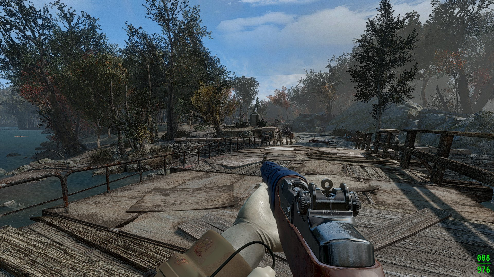
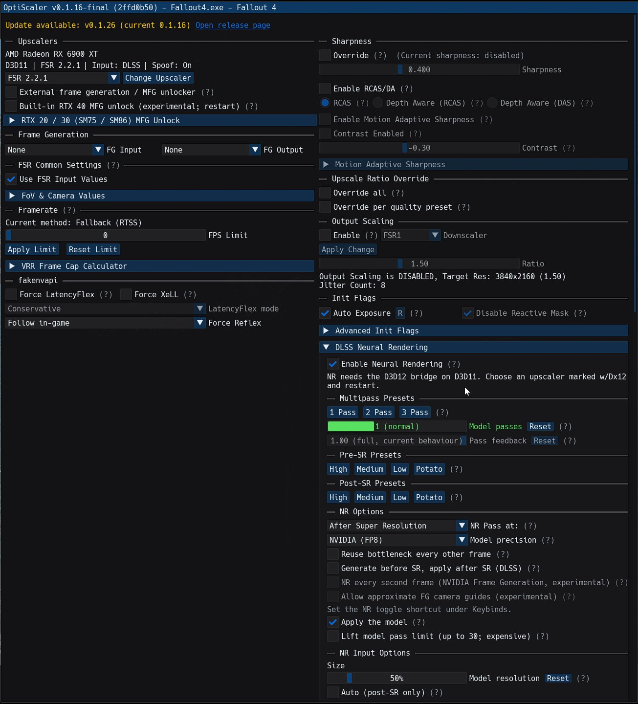

# DLSS 5 Neural Rendering on AMD RX 6000 cards (experimental)

**Deutsch:** [README_DE.md](README_DE.md)

## What is this?

NVIDIA made a new graphics feature called **DLSS Neural Rendering** ("DLSS 5"). It makes games look
more realistic: better light, more detail, nicer colours. Normally it **only works on NVIDIA cards**.

This mod makes it run on **AMD Radeon RX 6000** graphics cards (RDNA2).

> **Experimental.** It can crash, look wrong, or cost a lot of FPS. Do not use it in online games with
> anti-cheat.

## Does my PC work?

You need **all** of these:

| | |
|---|---|
| ✅ Graphics card | AMD **RX 6000 series**, see the table below. RX 7000/9000, NVIDIA and Intel do **not** work. |
| ✅ Windows | Windows 10 or 11, 64-bit |
| ✅ AMD driver | A recent AMD Adrenalin driver ([download](https://www.amd.com/en/support/download/drivers.html)) |
| ✅ Game | A 64-bit DirectX 11 or DirectX 12 game where you can choose **DLSS, FSR or XeSS** in the graphics settings |
| ✅ NVIDIA model file | `nvngx_dlssnr.dll`. **Not included**, you have to get it yourself (see step 2) |

| Graphics card | Status | Time per model frame |
|---|---|---|
| RX 6800 / 6800 XT / 6900 XT / 6950 XT | ✅ tested | ~40 ms |
| RX 6700 / 6700 XT / 6750 XT | 🧪 should work, **untested** (v0.2-beta) | ~80 ms (estimate) |
| RX 6600 / 6600 XT / 6650 XT | 🧪 should work, **untested** (v0.2-beta) | ~110 ms (estimate) |
| RX 6500 XT / 6400 | 🧪 should work, very slow | 250 ms+ |

**Have an RX 6700 or RX 6600?** Please try v0.2-beta and tell us in [Issues](../../issues) if it works
(attach your `dlssnr_nr.log`).

Not sure which graphics card you have? Press `Ctrl + Shift + Esc`, click **Performance**, click **GPU**.
The name is in the top right corner.

## Installation

### Step 1: Download

Go to [**Releases**](../../releases/latest) and download the ZIP (`DLSS5-RDNA2-Experimental-...zip`). RX 6700 / 6600 / 6500: take **v0.2-beta**.

### Step 2: Get the NVIDIA model file

This mod does **not** contain any NVIDIA files. You need the file **`nvngx_dlssnr.dll`** (about 160 MB).
How to get it is explained in janblade's guide:
[Choose the correct runtime](https://github.com/janblade/OptiScaler-DLSSNR-PreSR-Multipass/blob/main/INSTALL-DLSSNR.md#choose-the-correct-runtime).

### Step 3: Find your game folder

This is the folder with the game's `.exe` file.

- **Steam:** right-click the game → **Manage** → **Browse local files**
- **Epic / GOG / others:** right-click the game → open install folder

If there is a `bin` or `Binaries\Win64` folder with the `.exe` inside, use that folder.

### Step 4: Copy the files

1. Open the ZIP from step 1.
2. Copy **everything** in it into the game folder. Click **Replace** if Windows asks.
3. Copy `nvngx_dlssnr.dll` from step 2 into the same game folder.

### Step 5: Run the setup

In the game folder, double-click **`setup_windows.bat`**. A black window opens and asks some questions:

| Question | Type |
|---|---|
| "Do you want to delete these files?" (only if an old OptiScaler is there) | `1` + Enter |
| "Choose a filename for OptiScaler" | just Enter (= `dxgi.dll`) |
| "dxgi.dll already exists ... overwrite?" (you use ReShade or another mod) | `2` + Enter, then pick `2` (`winmm.dll`) |
| "Are you using an Nvidia GPU or AMD/Intel GPU?" | `1` + Enter (AMD) |

When the window says it is done, close it.

### Step 6: Start the game

1. In the game's graphics settings, turn on **DLSS**, **FSR** or **XeSS** (whatever the game offers).
2. In the game, press the **`Insert`** key. The OptiScaler menu opens.
3. Open **DLSS Neural Rendering** and make sure **Enable Neural Rendering** is ticked.
4. Press `Insert` again to close the menu.

The first start takes a few seconds longer. That is normal.

**DirectX 11 games** (for example Fallout 4): in the menu at the top, under **Upscalers**, pick an
upscaler that says **w/Dx12** (for example `FSR 2.2.1 w/Dx12`) and restart the game.

## It does not work. What now?

Open the file **`dlssnr_nr.log`** in the game folder with Notepad and look at the last lines:

| What the log says | What to do |
|---|---|
| `runtime ready` | It works. Check that Neural Rendering is enabled in the `Insert` menu. |
| `nvngx_dlssnr.dll missing or wrong version` | `nvngx_dlssnr.dll` is missing in the game folder, or it is a version with different weights. Get it again (step 2). |
| `not an RDNA2 GPU` | Your graphics card is not supported (see "Does my PC work?"). |
| `hipModuleLoad ...` | Your card could not load the program. Please report it in [Issues](../../issues) with the log. |
| No `dlssnr_nr.log` file at all | The mod did not load. Run `setup_windows.bat` again and check that you selected an upscaler in the game. |

## Uninstall

In the game folder, double-click **`Remove_OptiScaler.bat`**. Then delete `nr_data`, `nr_runtime.dll`,
`nr_port.ini` and `nvngx.dll_dlssnr.dll`.

## Is this faster or slower?

Slower. The AMD card has to do work that NVIDIA cards have special hardware for. On an RX 6900 XT
one model frame takes about 40 ms, smaller cards take longer (see the table above). Expect a big FPS drop. It is a tech demo, not a performance mod.

## Who made what?

| Part | By |
|---|---|
| The AI model (DLSS Neural Rendering) | **NVIDIA**. It lives in `nvngx_dlssnr.dll`, which you get yourself. |
| Getting the model to run on AMD RX 6000 | **This project** (`nr_runtime.dll`, `nvngx.dll_dlssnr.dll`, `nr_data`) |
| Getting it into games (menu, settings) | [**janblade's OptiScaler-DLSSNR**](https://github.com/janblade/OptiScaler-DLSSNR-PreSR-Multipass) and the [OptiScaler](https://github.com/optiscaler/OptiScaler) team, see `docs/CREDITS.md` in the release |

This project contains no NVIDIA files or weights. DLSS and NVIDIA are trademarks of NVIDIA
Corporation. This project is not affiliated with or endorsed by NVIDIA or AMD.

## For developers

The source code of `nr_runtime.dll` and `nvngx.dll_dlssnr.dll` is in [`src/`](src). Build with
`src\build.bat` (needs AMD ROCm 6.4 for Windows and Visual Studio 2022 Build Tools).

## License

[GPL-3.0](LICENSE)
